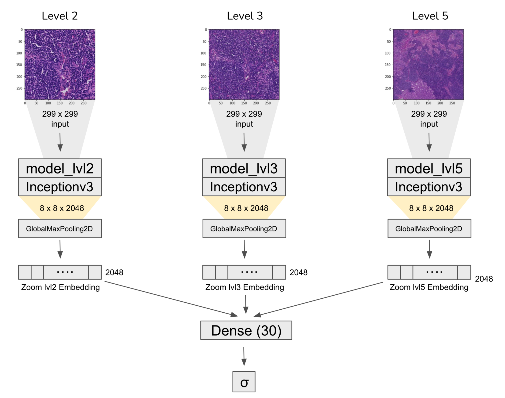

## Gigapixel Pathology Final Project

This Applied Deep Learning project attempts to replicate the [*Detecting Cancer Metastases on Gigapixel Pathology Images*](https://arxiv.org/abs/1703.02442) paper.  

The structure of the project is as follows:

* **preprocessing.ipynb**: This notebook creates the dataset for training, validation and testing. The slides are broken up to smaller images with varying zoom levels. Several types of data augmentation are then applied. 

* **training.ipynb**: This notebook trains an ensemble model of pretrained imagenet models for each zoom level of a certain part of a slide and the metric used is AUC.

[Presentaiton Slides](https://docs.google.com/presentation/d/1XsCnyzLhCObHvbIoS6Y3ll6tITPn-W8OUJrsybrinqA/edit?usp=sharing)